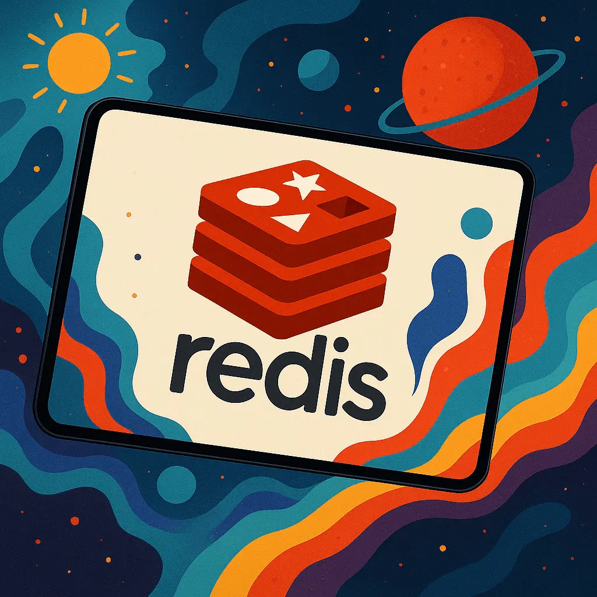

# Redis Clone — In-Memory Key-Value Store in Go

A fully functional Redis clone built in pure Go — no external libraries, no shortcuts. This project implements the RESP (Redis Serialization Protocol) from scratch, a custom TCP server with concurrent client handling via goroutines, a lexer and AST-based command parser, and a thread-safe in-memory key-value store.

Built not to use Redis, but to understand exactly how it works at every layer.

👉 Read the full article: [alejandro.buzz/projects/redis](https://alejandro.buzz/projects/redis)

---

## Features

# 📌 Why This Project Exists
=======
- ✔️ Full RESP (Redis Serialization Protocol) parser
- ✔️ Custom TCP server handling concurrent clients via goroutines
- ✔️ Lexer and AST-based command parser
- ✔️ Thread-safe in-memory key-value store
- ✔️ Custom Redis client included
- ✔️ Clean Go project structure across `cmd/`, `internal/`, and `pkg/`

---

## Why This Project Exists

Redis is one of the most widely used systems in modern infrastructure — caching, pub/sub, session stores, leaderboards. Most developers use it daily without knowing what happens between a `SET` command and the data being stored.

# 💾 Installation
1. **Clone the Repository**
=======
This project answers that question by implementing Redis from the ground up — every layer, every decision, in Go.

---

## Installation

**1. Clone the repository**
```bash
git clone https://github.com/dyxgou/redis
```

**2. Download dependencies**
```bash
go mod download
```

**3. Configure the environment**

Create a `.env` file in the root with the following:
```env
PORT=":5000"
```

**4. Build and run the server**
```bash
make
```

**5. Build the custom Redis client**
```bash
make client
```

---

## Architecture

The project follows idiomatic Go conventions:

cmd/        → server and client entrypoints
internal/   → core logic (parser, store, server)
pkg/        → shared utilities and protocol types

---

## Article

A deep dive into how this was built — from raw TCP sockets to the RESP protocol parser — with custom animations explaining each layer:

👉 [alejandro.buzz/projects/redis](https://alejandro.buzz/projects/redis)
